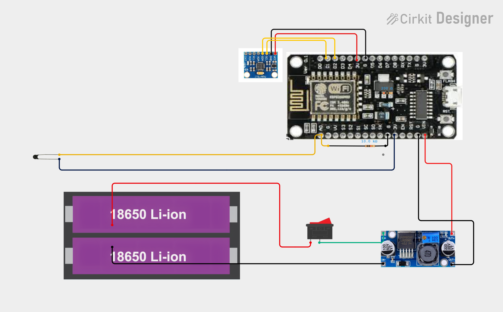
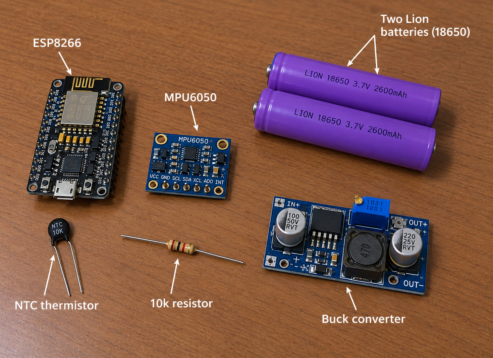
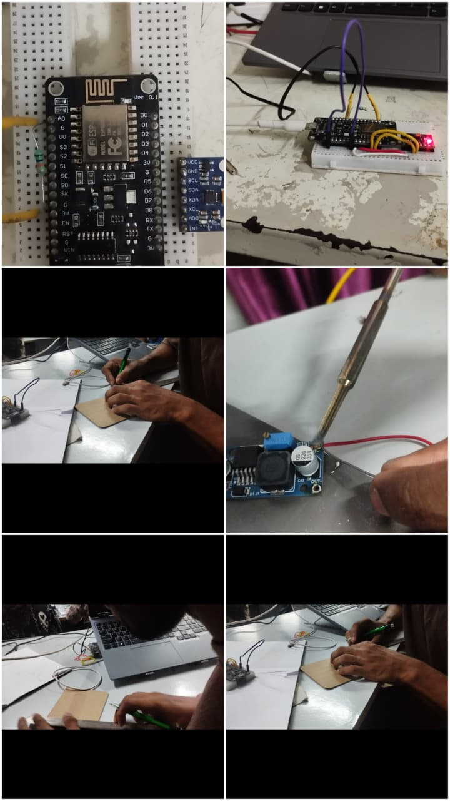
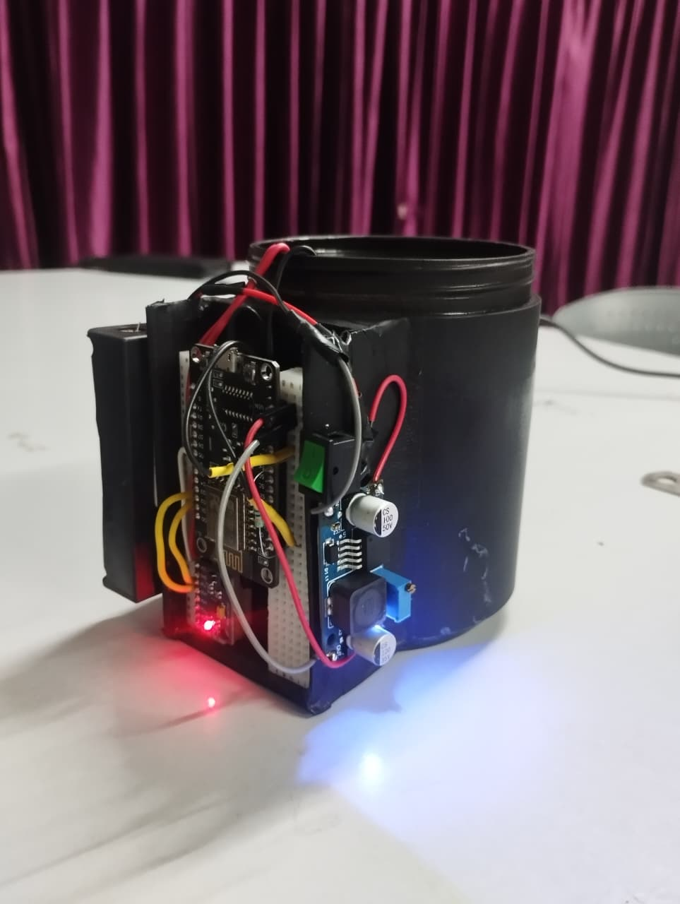

# Mug of Judgement 🎯

## Basic Details
### Team Name: Rouge One

### Team Members
- Team Lead: Ashwin Prasad P - JCET
- Member 2: Akhil TS - JCET

### Project Description
The **Mug of Judgement** is an IoT-powered smart container built using an ESP8266, an MPU6050 IMU, liquid sensors, and an NTC thermistor to monitor your beverage habits and physical states in real time. It tracks everything from drink temperatures and time-based greetings to anger shakes, slams, and phantom sips, translating them into automated behavioral triggers sent straight to Firebase.

### The Problem (that doesn't exist)
Mugs around the world have been suffering in absolute silence, forced to witness your emotional desk slams, empty phantom sips, and hours of neglected lukewarm coffee without any legal recourse or automated way to publicly shame you for it.

### The Solution (that nobody asked for)
An over-engineered IoT vessel rigged with an ESP8266, motion-tracking gyroscopes, liquid detectors, and a thermal sensor that actively monitors your rage levels, drink temperatures, and hygiene habits—instantly piping your daily emotional outbursts straight to a cloud database to log a permanent record of judgment.

## Technical Details
### Technologies/Components Used
For Software:
- C++ (Arduino framework)
- Arduino Core for ESP8266, ESP8266WebServer (Captive Portal & Web Server)
- ESP8266WiFi, ESP8266WebServer, DNSServer (for Wi-Fi provisioning captive portal)
 ESP8266HTTPClient, WiFiClientSecure (for secure HTTPS communication with Firebase)
 NTPClient, WiFiUdp (for network time synchronization)
 Wire (for I2C communication with the MPU6050)
 EEPROM (for persistent Wi-Fi credential storage)
- Arduino IDE, Firebase Realtime Database (cloud logging backend)

For Hardware:
- Generic ESP8266 Module / NodeMCU microcontroller

MPU6050 6-Axis Accelerometer and Gyroscope Module

NTC Thermistor (Temperature sensor connected to analog pin A0)

Liquid presence sensor pins (configured with INPUT_PULLUP)

- Operating Voltage: 3.3V

Communication Protocol: I2C (for MPU6050), Wi-Fi 802.11 b/g/n (2.4 GHz)

Analog-to-Digital Converter (ADC): 10-bit resolution (A0 pin)

- Breadboard, jumper wires, soldering iron (optional), micro-USB data cable, cardboard&plastic structural housing

### Implementation
For Software:
# Installation
1.Download and open the Arduino IDE.

2.Add the ESP8266 board package URL ([https://arduino.esp8266.com/stable/package_esp8266com_index.json](https://arduino.esp8266.com/stable/package_esp8266com_index.json)) to your Arduino IDE Additional Boards Manager URLs.

3.Go to Tools > Board > Boards Manager, search for esp8266, and install the package.

4.Install the required library via the Library Manager (Ctrl+Shift+I or Tools > Manage Libraries):NTPClient by Fabrice Weinberg

# Run
1.Connect your ESP8266 board to your computer via a USB cable.

2.Select your corresponding Board and COM Port under the Tools menu in the Arduino IDE.

3.Paste the provided source code into the Arduino IDE sketch window and click Upload.

4.On first boot (if no credentials are saved), the ESP8266 will broadcast an open Wi-Fi network named Mug-Of-Judgement-Setup (password: judgement123).

5.Connect your phone or computer to this network, open a browser to load the captive portal, and enter your home Wi-Fi SSID and password to save them to the EEPROM.

6.The device will automatically restart, connect to your Wi-Fi network, synchronize time via NTP, and begin monitoring motion, temperature, liquid state, and dispatching judgmental events to your Firebase Realtime Database.

### Project Documentation
For Software:

# Screenshots (Add at least 3)

# Diagrams

The workflow diagram illustrates the end-to-end event-driven pipeline of the Mug of Judgement, mapping how raw physical telemetry is captured locally, evaluated against behavioral algorithms, and dispatched to the cloud backend.

For Hardware:

# Schematic & Circuit

Circuit wiring diagram showing I2C connections for the MPU6050, analog input routing for the NTC thermistor, and liquid sensor wiring.

Electrical schematic outlining power regulation, ground distribution, and signal paths across the ESP8266 NodeMCU.

*Add caption explaining the schematic*

# Build Photos

Laid-out components featuring the ESP8266, MPU6050 IMU, NTC thermistor, wires.

Step-by-step assembly showing electronics housed inside a custom cardboard enclosure mounted perpendicularly.

The completed Mug of Judgement setup with perpendicular sensor housing.

### Project Demo
# Video

---
Made with ❤️ at TinkerHub Useless Projects 

